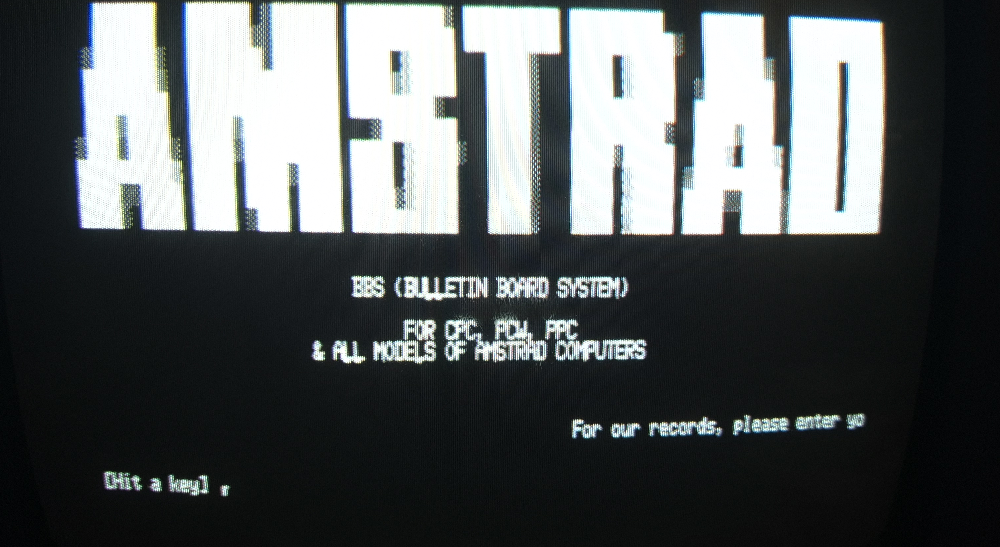

# N4CEWENTERM - ANSI Telnet Client for Amstrad CPC

An ANSI terminal emulator and Telnet client for the Amstrad CPC with Net4CPC (W5100S Ethernet) hardware.

**⚠️ ALPHA SOFTWARE - NOT FOR PRODUCTION USE** 

This is experimental, early-stage development code. Features are actively being developed and tested. Expect bugs, crashes, and incomplete functionality. **Not suitable for any serious or production use.** Use at your own risk for testing and experimentation only.

## Overview

N4CEWENTERM is a full-featured telnet client based on the classic Ewenterm (1991) and M4EWENTERM (2023), adapted for the Net4CPC hardware. It supports:

- **ANSI terminal emulation** - Colors, cursor positioning, text attributes
- **Telnet protocol** - IAC command negotiation
- **DNS resolution** - Connect using hostnames (e.g., "aardwolf.org")
- **IP connections** - Direct IP address connections
- **Custom ports** - Specify ports (e.g., "example.com:23")

## Network Library

This application includes local copies of the n4c-nettools networking library:
- `src/n4c-netinit-kv.s` - Network initialization from config file (key=value format)
- `src/w5100.s` - W5100S hardware driver (28KB)
- `src/dns_simple.s` - DNS resolver (14KB)

These files are maintained in the main n4c-nettools repository. See `../n4c-nettools/` for the reference implementation and documentation.

**Note:** This is a self-contained application. All required files are included in this directory.

## Network Configuration

Network settings are now stored in `N4C.CFG` instead of being hardcoded in BASIC. This makes it easy to change your IP address without modifying any code.

**Benefits:**
- ✅ Easy to change network settings
- ✅ Same config file for all n4c-nettools applications
- ✅ No BASIC code editing required
- ✅ Portable between different networks

See `CONFIG.md` for full configuration documentation.

## Building

### Requirements
- **RASM** assembler (http://www.roudoudou.com/rasm/)

### Build Steps
```bash
./build.sh
```

This produces:
- `N4CEWEN.BIN` - Terminal program (12466 bytes)
- `CHARSET.BIN` - Character set (2176 bytes)

## Installation

### 1. Create Network Configuration

Create a file named `N4C.CFG` on your CPC with your network settings:

```
IP=192.168.1.100
MASK=255.255.255.0
GW=192.168.1.1
DNS=192.168.1.1
```

**Format:** Key=value pairs, one per line
**Line endings:** DOS-style (CR+LF) required for Amstrad CPC

See `CONFIG.md` for detailed configuration instructions and troubleshooting.

### 2. Copy Files to CPC

Copy these files to your CPC:
1. `src/N4CEWEN.BAS` - BASIC loader
2. `bin/N4CEWEN.BIN` - Terminal program
3. `bin/CHARSET.BIN` - Character set
4. `N4C.CFG` - Your network configuration

### 3. Run

```basic
RUN"N4CEWEN
```

The program will:
- Read your network settings from `N4C.CFG`
- Initialize the Net4CPC hardware
- Display your configuration
- Start the terminal if successful

## Usage

**Connect by hostname:** `aardwolf.org`
**With custom port:** `example.com:2323`  
**By IP:** `192.168.1.50:23`

**During session:**
- ESC - Disconnect
- TAB - Pause/unpause

## Project Structure

Shared library: `../n4c-nettools/` (W5100S driver, DNS resolver)
This app: Telnet-specific code only

See README files in each directory for details.

## Credits and Attribution

This project builds upon and integrates code from several excellent projects:

### Terminal Emulation
- **[Ewenterm](https://ewen.mcneill.gen.nz/programs/cpc/ewenterm/)** (1991) - Original ANSI terminal emulator for Amstrad CPC by Ewen McNeill
- **[M4EWENTERM](https://github.com/fergusleen/m4ewenterm)** (2023) - M4 Board adaptation by Fergus Leen
- **Duke's M4 Telnet** - Additional telnet implementation for M4

### Network Stack
- **[KCNet for Net4CPC](https://github.com/salafek/KCNet-software-for-Net4CPC)** - DNS resolver and networking code by salafek
- Adapted W5100S drivers and network protocols for Net4CPC hardware

### Hardware
- **[Net4CPC](https://github.com/salafek/Net4CPC)** - W5100S Ethernet interface board for Amstrad CPC by salafek

### This Adaptation
- Network configuration system (file-based config)
- Integration of DNS resolution with telnet client
- Debugging and adaptation for Net4CPC hardware (2026)

## License

This project is licensed under the GNU General Public License v3.0 - see the [LICENSE](LICENSE) file for details.
